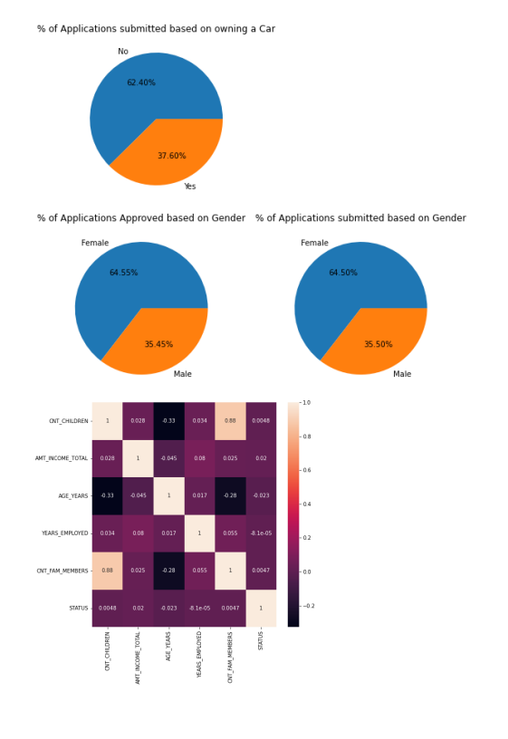

# Credit-Card-Approval-Prediction

Machine Learning is an application that provides
computers the ability to learn and improve from the experience without 
being explicitly programmed. Machine Learning is classified into different 
types. They are as follows:
1)Supervised Learning:
Supervised learning is the task of machine learning that maps the input 
to an output based on input-output patterns to the system. 
Supervised learning is classified into two types of regression and 
classification.
A) Regression: Regression is classified under the same branch of 
supervised learning. In machine learning regression algorithm try’s to 
estimate the mapping function(f) from the variable (x) to numerical or 
continuous output variable(y).
Example: To predict the prices of the houses, that is the regression task 
because price 
of the houses will be the continuous output.
B) Classification: Classification is classified under the same branch of 
supervised learning. In machine learning classification algorithm try’s to 
calculate the mapping function(f) from the input (x) to discrete or 
categorial output variables(y).
Example: To predict the prices of the houses “sell more or less than the 
recommended retail price.” Here, the houses will be classified whether 
their prices fall into two discrete categories: above or below the said 
price

2)Unsupervised Learning:
Unsupervised learning is a self-learning technique in which system has 
to discover the features of the input population by its own and no prior 
set of categories are used.
Linear Regression is the example of Regression.
This project aims at developing two supervised Machine Learning 
Model- Linear Regression from scratch using Python and NumPy. The 
developed code has various parameters. From the given models Bias Variance Trade-off and Prediction the best model can be selected from 
the given data. This project enables the users to use the parameters and 
select the best model in Linear Regression.

I have selected this project because it is one of the main 
aspects of life. It is important to know if your credit card gets 
approved or not well before in time to plan life and other 
situations. It is very challenging to predict this information by 
humans as there are several dependent variables. My aim is to 
Build a machine learning model which is used predict whether 
an applicant is a good customer or a bad customer. So many 
people apply for credit card, and we need to understand which 
applicant is good enough to get the approval. A machine can 
predict the approval if well trained. In this project several 
methods, models, and parameters are tested to get highest 
prediction accuracy. My aim is to Build a machine learning 
model which is used predict whether an applicant is a good 
customer or a bad customer. So many people apply for credit 
card, and we need to understand which applicant is good 
enough to get the approval
